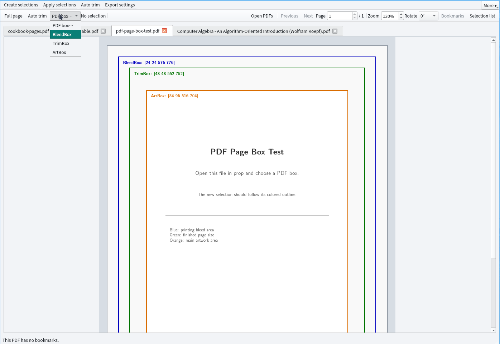

# prop

prop (PDF crop) is an Arch Linux / Wayland desktop application based on C++17, Qt 6, Poppler Qt6, and MuPDF. Open a PDF, drag the mouse to select a region within the app, then choose an export method. No `slurp`, `pdfcrop`, or `mutool` commands required.



[View dark theme preview](screenshot-dark-theme.png)

[View 1600% local rendering preview](screenshot-1600.png)

## Running

The bundled `bin/prop` is a dynamically linked program compiled on Arch Linux x86_64. It requires `qt6-base`, `qt6-wayland`, `poppler-qt6`, and `libmupdf` to be installed:

```sh
sudo pacman -S --needed qt6-base qt6-wayland poppler-qt6 libmupdf
./bin/prop [input-file.pdf]
```

Alternatively, you can build it yourself:

```sh
sudo pacman -S --needed base-devel cmake ninja pkgconf qt6-base qt6-wayland qt6-tools poppler-qt6 libmupdf
cmake -S . -B build-prop -G Ninja -DCMAKE_BUILD_TYPE=Release
cmake --build build-prop
./build-prop/prop [input-file.pdf]
```

If Python 3 and Poppler command-line tools are installed, run the export and view smoke tests with `ctest --test-dir build-prop --output-on-failure`.

## Usage

The four menus at the top follow the cropping workflow:

1. **Create selections:** Drag on a page to add a selection. Click and drag an existing selection to move it; Ctrl+drag creates one inside an existing selection. The menu offers full-page and grid selections, fixed or custom aspect ratios, device-proportion splitting, and deletion. Choose Custom to edit its positive width and height directly in the menu. Insert adds a full-page selection, and Shift+arrow moves the active selection one screen pixel. The right sidebar lists every page's selections; click to navigate, Shift+click to select a range, or Ctrl+click to add or remove one selection. Delete or the menu button removes the selected list entries, including entries on different pages; with no list entries selected, it removes the active preview selection. Shared selections are deleted once even if selected on several pages. Move up/Move down changes the active selection's export order and is unavailable while multiple entries are selected. Each selection becomes one output page.
2. **Apply selections:** Share selections across all pages, maintain separate odd/even sets, or set them per page. In the first two modes, exceptional pages such as `1,5-7,2x+1` can have their own selections. In per-page mode, only pages with selections are cropped by default.
3. **Auto trim:** Trim using the current page, or use all pages sharing a selection to find one safe boundary. In odd/even mode the latter checks only pages in the same group; on an exceptional or individually selected page it is unavailable. Padding is in millimetres. A coloured page background is treated as content. If the current page has no selection, trimming starts with a full-page selection.
4. **Export settings:** The single-column menu selects cropped pages from the current page, all pages, or a range such as `1-5,8,10-,2x+1`, and vector or strict raster output. In per-page mode, "All pages" becomes "Pages with selections"; a specified range containing a page without a selection raises a warning before the save dialog. Set DPI for raster output and optional output rotation. When the result has multiple pages, **Save each selection separately** creates one PDF per selection inside a newly named folder. The folder name is yours; files are named `page-01-selection-01.pdf`, and an existing folder is never overwritten. **Export complete pages…** opens a separate page-range dialog and copies whole pages without using selections or crop settings.

Page expressions can combine page numbers, inclusive ranges, open-ended ranges, and arithmetic sequences. `2x+1` selects pages 3, 5, 7, …; `3x+3` selects pages 6, 9, 12, …, stopping at the document's last page. Here `x` starts at 1.

The second toolbar row starts with shortcuts for a full-page selection and trimming with the current page. **PDF box…** adds a selection from an explicitly defined BleedBox, TrimBox, or ArtBox on the current page. Boxes outside the visible CropBox are clipped to it; absent boxes are unavailable. The size beside the shortcuts shows the active selection in millimetres before output rotation. These selections follow the chosen shared, odd/even, or per-page application mode. The controls on the upper right open PDFs and navigate, zoom, rotate the preview, and toggle bookmarks and the selection list independently for each PDF tab. The "More" menu contains file history, theme, and language. Ctrl+O opens PDFs; Ctrl+W closes the current tab. The preview scroll wheel moves vertically, Shift+scroll moves horizontally, and Ctrl+scroll zooms. Space/Shift+Space changes pages when the preview has focus. Preview rotation leaves the exported page orientation unchanged unless output rotation is also set.

## Batch export

`--go` exports without opening the window and works without a desktop display. It uses a full-page selection unless `--grid` is given. For example:

```sh
./build-prop/prop --go --trim --trim-use all --trim-padding 2 --whichpages 1-5,8 -o cropped.pdf input.pdf
./build-prop/prop --go --grid 2x1 --device 730x600 --rotate 90 -o reader.pdf input.pdf
./build-prop/prop --go --strict --dpi 300 --whichpages 2x+1 -o strict.pdf input.pdf
./build-prop/prop --go --separate --grid 2x1 --whichpages 1,3 -o my-crops input.pdf
./build-prop/prop --go --complete-pages --whichpages 1-5,8 -o pages.pdf input.pdf
```

Run `./build-prop/prop --help` for all options. Per-page and exception selections are edited in the GUI; they are not available in `--go` mode. `--separate` uses `-o` as a new folder path and requires at least two output selections. `--complete-pages` cannot be combined with crop options.

The "History" menu stores the paths of the 10 most recently opened files, which can be reopened or cleared; the "Theme" menu switches between light and dark; the "Language" menu switches between Simplified Chinese and English. These settings are retained on the next launch. prop imports history, theme, and language settings from the previous application name on first launch. Interface translations are located in `i18n/` and are compiled and embedded into the program at build time by Qt Linguist Tools.

The preview uses Poppler's anti-aliased local rendering, generating only the pixels near the viewport rather than caching a full-page high-magnification bitmap. As a result, text and vector graphics at high magnification are still rendered at the current magnification, and memory usage mainly varies with window size. Low-resolution images embedded in the source PDF will not become clearer as a result.

"Preserve text and vectors (remove as much as possible)" uses MuPDF to filter out drawing objects that lie entirely outside the selection, adjusts the output page size, and preserves searchable text and vector graphics within the selection. **Images, glyphs, or complex drawing objects that cross the boundary may still carry data from outside the selection**; do not use this mode for sensitive information that must be thoroughly removed. The visual result for some complex PDFs may also differ slightly from the original. When one source page produces multiple output pages, document-level metadata and bookmarks may not be retained.

"Export complete pages" retains the selected pages' content and page boxes, but saves a new PDF rather than a byte-for-byte copy. Bookmarks or links pointing to omitted pages may need review.

"Strict removal (convert to image)" renders only the page pixels within the selection, then writes them into a brand-new PDF. Text, vectors, annotations, attachments, and original image streams from the source file are not copied to the output file. It is suitable for scenarios where the original PDF data outside the region must be removed, but the output page is a bitmap, so text cannot be searched or selected, and vector editability is not preserved. A DPI of 150–600 can be selected, with a default of 300 DPI; overly large pages will prompt you to lower the DPI.

Encrypted PDFs are not currently supported. The window waits for processing to complete during export, and large files may take some time.

## License

The source code of this project is licensed under [AGPL-3.0-or-later](LICENSE). The project links against MuPDF; when redistributing or using it in a closed-source context, you should verify MuPDF's AGPL / commercial licensing terms. Qt, Poppler, and their dependencies remain under their respective licenses.
