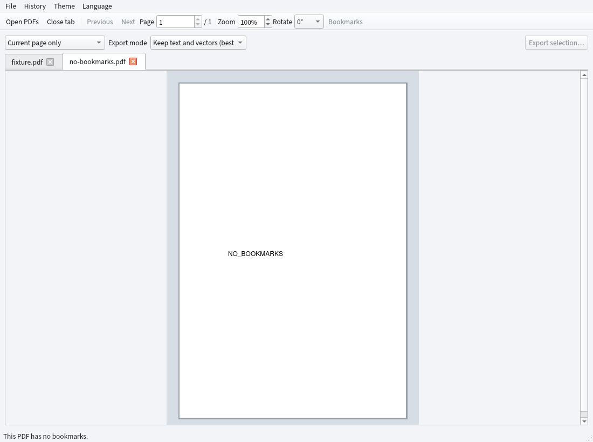

# PDF Region Cropping

An Arch Linux / Wayland desktop application based on C++17, Qt 6, Poppler Qt6, and MuPDF. Open a PDF, drag the mouse to select a region within the app, then choose an export method. No `slurp`, `pdfcrop`, or `mutool` commands required.



[View dark theme preview](screenshot-dark.png)

[View Chinese interface preview](screenshot.png)

[View 1600% local rendering preview](screenshot-1600.png)

## Running

The bundled `bin/pdf-select-crop` is a dynamically linked program compiled on Arch Linux x86_64. It requires `qt6-base`, `qt6-wayland`, `poppler-qt6`, and `libmupdf` to be installed:

```sh
sudo pacman -S --needed qt6-base qt6-wayland poppler-qt6 libmupdf
./bin/pdf-select-crop [input-file.pdf]
```

Alternatively, you can build it yourself:

```sh
sudo pacman -S --needed base-devel cmake ninja pkgconf qt6-base qt6-wayland qt6-tools poppler-qt6 libmupdf
cmake -S . -B build -G Ninja -DCMAKE_BUILD_TYPE=Release
cmake --build build
./build/pdf-select-crop [input-file.pdf]
```

## Usage

1. Use Ctrl+O or "Open PDF" to select multiple files; each PDF appears in its own tab. Ctrl+W or the close button on the tab closes the current tab. Reopening an already-open file switches to its existing tab.
2. Hold the left mouse button and drag on the page to draw a cropping rectangle. The page number box at the top allows direct navigation; when the preview area has focus, Space/Shift+Space moves to the next/previous page.
3. In the preview area, the scroll wheel moves up and down, Shift+scroll moves left and right, and Ctrl+scroll zooms. The zoom range is 25%–1600%, in 10% steps; the zoom control at the top also accepts a directly entered percentage. The selection is preserved when zooming.
4. The "Rotate" control provides four preview angles: 0°, 90°, 180°, and 270°. After rotation, the selection still corresponds to the correct position in the original PDF; the exported PDF retains the original page orientation.
5. PDFs with bookmarks display a bookmark sidebar that can be clicked to jump; when there are no bookmarks, the button is disabled and the sidebar is hidden.
6. Choose "Export current page only" or "Apply the same selection ratio to all pages." All-pages mode applies the selection by width and height ratio, which suits pages of different sizes and rotations.
7. Choose an export method, then click "Export selection…". The exported file must differ from the original file.

The "History" menu stores the paths of the 10 most recently opened files, which can be reopened or cleared; the "Theme" menu switches between light and dark; the "Language" menu switches between Simplified Chinese and English. These settings are retained on the next launch. Interface translations are located in `i18n/` and are compiled and embedded into the program at build time by Qt Linguist Tools.

The preview uses Poppler's anti-aliased local rendering, generating only the pixels near the viewport rather than caching a full-page high-magnification bitmap. As a result, text and vector graphics at high magnification are still rendered at the current magnification, and memory usage mainly varies with window size. Low-resolution images embedded in the source PDF will not become clearer as a result.

"Preserve text and vectors (remove as much as possible)" uses MuPDF to filter out drawing objects that lie entirely outside the selection, adjusts the output page size, and preserves searchable text and vector graphics within the selection. **Images, glyphs, or complex drawing objects that cross the boundary may still carry data from outside the selection**; do not use this mode for sensitive information that must be thoroughly removed. The visual result for some complex PDFs may also differ slightly from the original.

"Strict removal (convert to image)" renders only the page pixels within the selection, then writes them into a brand-new PDF. Text, vectors, annotations, attachments, and original image streams from the source file are not copied to the output file. It is suitable for scenarios where the original PDF data outside the region must be removed, but the output page is a bitmap, so text cannot be searched or selected, and vector editability is not preserved. A DPI of 150–600 can be selected, with a default of 300 DPI; overly large pages will prompt you to lower the DPI.

Encrypted PDFs are not currently supported. The window waits for processing to complete during export, and large files may take some time.

## License

The source code of this project is licensed under [AGPL-3.0-or-later](LICENSE). The project links against MuPDF; when redistributing or using it in a closed-source context, you should verify MuPDF's AGPL / commercial licensing terms. Qt, Poppler, and their dependencies remain under their respective licenses.
